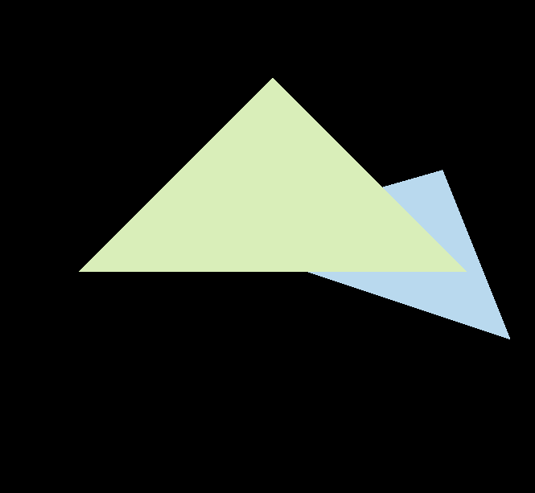
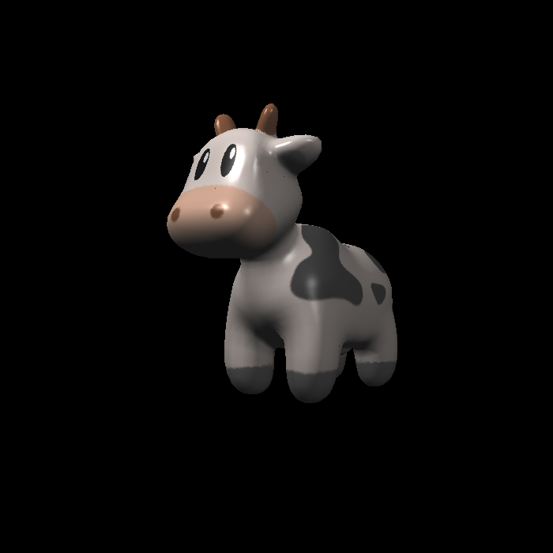
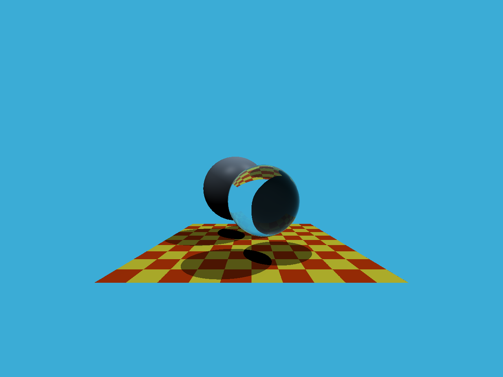
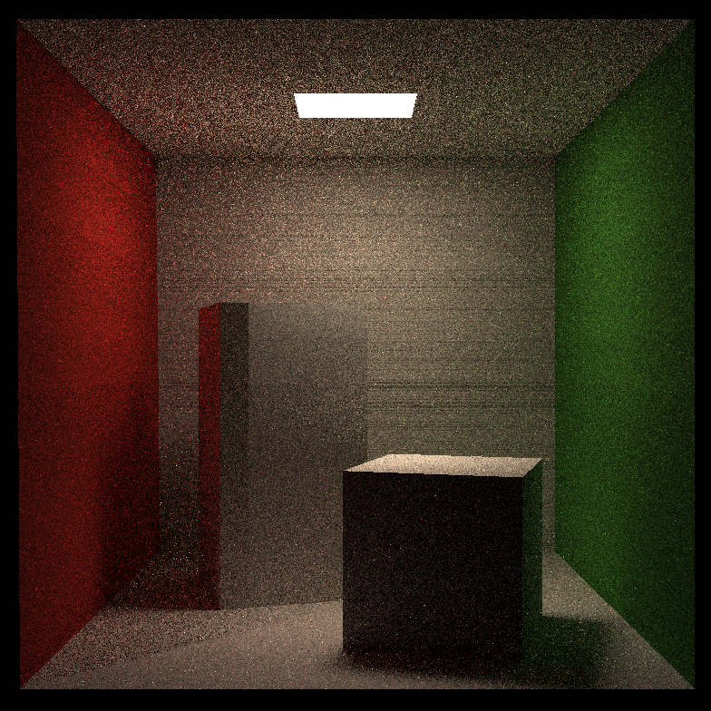

# GAMES101 Homework

本仓库是 GAMES101《现代计算机图形学入门》的课程作业实现合集，主要使用 C++17、CMake、Eigen 和 OpenCV 完成。内容覆盖基础变换、光栅化、深度缓冲、着色、Bezier 曲线、光线追踪、BVH 加速结构、路径追踪和质点弹簧绳子模拟。

## 作业目录

| 目录 | 主题 | 主要内容 |
| --- | --- | --- |
| `00` | Transformation | Eigen 向量、矩阵和基础变换 |
| `01` | Rasterizer | MVP 变换、三角形光栅化 |
| `02` | Z-buffering | 深度缓冲、三角形覆盖测试 |
| `03` | Shading | Blinn-Phong、纹理、法线、凹凸和位移着色 |
| `04` | Bezier Curve | De Casteljau 递归 Bezier 曲线 |
| `05` | Ray Tracing | Whitted-style 光线追踪、反射和折射 |
| `06` | BVH | 包围盒、BVH 构建与求交加速 |
| `07` | Path Tracing | Cornell Box、面积光源、直接/间接光采样 |
| `08` | Rope Simulation | 质点弹簧系统、Euler/Verlet 绳子模拟 |
| `Final` | Final Project | 课程最终项目报告 |

## 效果预览

| Z-buffering | Texture | Ray Tracing | Path Tracing |
| --- | --- | --- | --- |
|  |  |  |  |

更多结果可以在各作业的 `images` 目录中查看，例如 `01/images/rasterizer.png`、`03/images/phone.png`、`06/images/bvh.ppm` 和 `08/images/ropesim.png`。

## 环境依赖

- CMake 3.10+
- 支持 C++17 的 C++ 编译器
- Eigen3
- OpenCV
- OpenGL、Freetype、Threads（主要用于 `08`）

`08/CGL` 中包含了 CGL、GLFW、GLEW 等作业框架相关代码，但仍需要系统提供 OpenGL 和 Freetype 等依赖。

## 构建

推荐按单个作业目录分别构建，这样输出文件和运行目录更清晰：

```powershell
cmake -S 03 -B build/03 -DCMAKE_BUILD_TYPE=Release
cmake --build build/03 --config Release
```

也可以从仓库根目录一次性生成全部目标：

```powershell
cmake -S . -B build -DCMAKE_BUILD_TYPE=Release
cmake --build build --config Release
```

不同 CMake 生成器的可执行文件输出位置可能不同；Visual Studio 等多配置生成器通常会放在 `Debug` 或 `Release` 子目录中。

## 运行示例

```powershell
# Assignment 00
.\build\00\Release\Transformation.exe

# Assignment 01: angle = 45, output = rasterizer.png
.\build\01\Release\Rasterizer.exe -r 45 rasterizer.png

# Assignment 02
.\build\02\Release\Z-buffering.exe zbuffer.png

# Assignment 03: shader 可选 phong / texture / normal / bump / displacement
.\build\03\Release\Shading.exe shading.png phong

# Assignment 04: 在窗口中点击 4 个控制点
.\build\04\Release\BezierCurve.exe

# Assignment 05-07: 运行后会在工作目录输出 PPM 图片
.\build\05\Release\RayTracing.exe
.\build\06\Release\BVH.exe
.\build\07\Release\PathTracing.exe

# Assignment 08
.\build\08\Release\ropesim.exe
.\build\08\Release\ropesim.exe -m 1.0 -g 0 -9.8 -s 64
```

请根据实际生成器和构建目录调整可执行文件路径；在类 Unix 环境下通常去掉 `.exe` 后缀。

## 注意事项

- `04` 是交互式 OpenCV 窗口程序，需要用鼠标左键依次点击 4 个控制点。
- `05`、`06`、`07` 的程序运行结果仍会输出 PPM 文件；README 中的 `05/images/raytracing.png` 和 `07/images/pathtracing.png` 是为了 GitHub 预览额外转换出的 PNG。
- 本仓库仅作为个人课程学习记录和实现参考。
